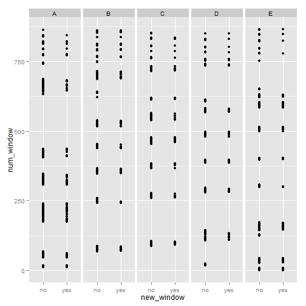
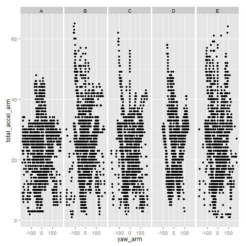
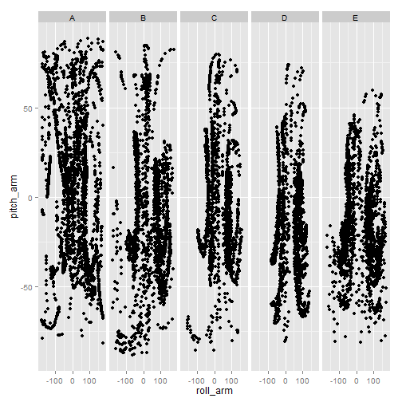
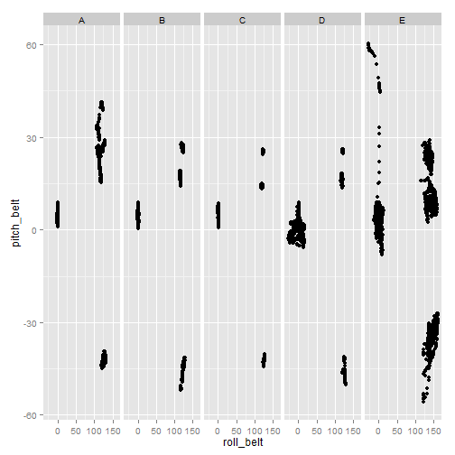

Predict Class of Exercise
========================================================
## Abstract
Using devices such as Jawbone Up, Nike FuelBand, and Fitbit it is now possible to collect a large amount of data about personal activity relatively inexpensively. One thing that people regularly do is quantify how much of a particular activity they do, but they rarely quantify how well they do it. 
In this analysis, we choose 18 kind of features to predict which exercise class they do, 
and train using random forest (RF) method.
We find that the expected error rate is about 0.3% in test sample.
Therefore, we can predict which class of exercise they do.

## Prerequisite


```r
# code is commented because we downloaded the data once
# download.file('https://d396qusza40orc.cloudfront.net/predmachlearn/pml-training.csv',
# destfile='pml-training.csv', method='curl');
# download.file('https://d396qusza40orc.cloudfront.net/predmachlearn/pml-testing.csv',
# destfile='pml-testing.csv', method='curl');
```


```r
library(caret)
```

```
## Loading required package: lattice
## Loading required package: ggplot2
```


## Data Preprocessing and Analysis

Loading data and creating partition of training set into two
- to train model
- to cross validate

Let's summerize training set picking correct and suitable features to predict


```r
raw_training <- read.csv(".//data//pml-training.csv")
testing <- read.csv(".//data//pml-testing.csv")

set.seed(1)
inTrain <- createDataPartition(y = raw_training$classe, p = 0.6, list = F)
training <- raw_training[inTrain, ]
cv <- raw_training[-inTrain, ]

summary(training)
```

```
##        X            user_name    raw_timestamp_part_1 raw_timestamp_part_2
##  Min.   :    2   adelmo  :2354   Min.   :1.32e+09     Min.   :   312      
##  1st Qu.: 4937   carlitos:1832   1st Qu.:1.32e+09     1st Qu.:252287      
##  Median : 9796   charles :2126   Median :1.32e+09     Median :497249      
##  Mean   : 9817   eurico  :1845   Mean   :1.32e+09     Mean   :503145      
##  3rd Qu.:14739   jeremy  :2074   3rd Qu.:1.32e+09     3rd Qu.:756314      
##  Max.   :19622   pedro   :1545   Max.   :1.32e+09     Max.   :998749      
##                                                                           
##           cvtd_timestamp new_window    num_window    roll_belt    
##  28/11/2011 14:14: 899   no :11502   Min.   :  1   Min.   :-28.9  
##  05/12/2011 11:24: 890   yes:  274   1st Qu.:222   1st Qu.:  1.1  
##  30/11/2011 17:11: 887               Median :427   Median :113.0  
##  02/12/2011 14:57: 844               Mean   :432   Mean   : 64.4  
##  05/12/2011 11:25: 826               3rd Qu.:647   3rd Qu.:123.0  
##  02/12/2011 13:34: 824               Max.   :864   Max.   :162.0  
##  (Other)         :6606                                            
##    pitch_belt        yaw_belt      total_accel_belt kurtosis_roll_belt
##  Min.   :-55.80   Min.   :-180.0   Min.   : 0.0              :11502   
##  1st Qu.:  1.78   1st Qu.: -88.3   1st Qu.: 3.0     #DIV/0!  :    7   
##  Median :  5.27   Median : -12.7   Median :17.0     -0.060160:    1   
##  Mean   :  0.21   Mean   : -11.0   Mean   :11.3     -0.060755:    1   
##  3rd Qu.: 14.90   3rd Qu.:  13.6   3rd Qu.:18.0     -0.100466:    1   
##  Max.   : 60.30   Max.   : 179.0   Max.   :29.0     -0.169891:    1   
##                                                     (Other)  :  263   
##  kurtosis_picth_belt kurtosis_yaw_belt skewness_roll_belt
##           :11502            :11502              :11502   
##  #DIV/0!  :   27     #DIV/0!:  274     #DIV/0!  :    6   
##  -0.150950:    3                       0.000000 :    3   
##  2.777851 :    3                       -0.003095:    1   
##  40.000000:    3                       -0.010002:    1   
##  7.770402 :    3                       -0.014020:    1   
##  (Other)  :  235                       (Other)  :  262   
##  skewness_roll_belt.1 skewness_yaw_belt max_roll_belt   max_picth_belt 
##           :11502             :11502     Min.   :-94     Min.   : 3     
##  #DIV/0!  :   27      #DIV/0!:  274     1st Qu.:-88     1st Qu.: 5     
##  -2.156553:    3                        Median : -6     Median :18     
##  -3.072669:    3                        Mean   :-10     Mean   :13     
##  -6.324555:    3                        3rd Qu.:  5     3rd Qu.:19     
##  0.000000 :    3                        Max.   :180     Max.   :30     
##  (Other)  :  235                        NA's   :11502   NA's   :11502  
##   max_yaw_belt   min_roll_belt   min_pitch_belt   min_yaw_belt  
##         :11502   Min.   :-180    Min.   : 0             :11502  
##  -0.9   :   21   1st Qu.: -88    1st Qu.: 3      -0.9   :   21  
##  -1.4   :   21   Median : -11    Median :16      -1.4   :   21  
##  -1.5   :   18   Mean   : -13    Mean   :10      -1.5   :   18  
##  -1.2   :   17   3rd Qu.:   3    3rd Qu.:17      -1.2   :   17  
##  -1.3   :   17   Max.   : 173    Max.   :23      -1.3   :   17  
##  (Other):  180   NA's   :11502   NA's   :11502   (Other):  180  
##  amplitude_roll_belt amplitude_pitch_belt amplitude_yaw_belt
##  Min.   :  0         Min.   : 0                  :11502     
##  1st Qu.:  0         1st Qu.: 1           #DIV/0!:    7     
##  Median :  1         Median : 1           0.00   :    9     
##  Mean   :  3         Mean   : 2           0.0000 :  258     
##  3rd Qu.:  2         3rd Qu.: 2                             
##  Max.   :360         Max.   :12                             
##  NA's   :11502       NA's   :11502                          
##  var_total_accel_belt avg_roll_belt   stddev_roll_belt var_roll_belt  
##  Min.   : 0           Min.   :-27     Min.   : 0       Min.   :  0    
##  1st Qu.: 0           1st Qu.:  1     1st Qu.: 0       1st Qu.:  0    
##  Median : 0           Median :115     Median : 0       Median :  0    
##  Mean   : 1           Mean   : 66     Mean   : 1       Mean   :  8    
##  3rd Qu.: 0           3rd Qu.:124     3rd Qu.: 1       3rd Qu.:  0    
##  Max.   :16           Max.   :157     Max.   :14       Max.   :201    
##  NA's   :11502        NA's   :11502   NA's   :11502    NA's   :11502  
##  avg_pitch_belt  stddev_pitch_belt var_pitch_belt   avg_yaw_belt  
##  Min.   :-51     Min.   :0         Min.   : 0      Min.   :-138   
##  1st Qu.:  2     1st Qu.:0         1st Qu.: 0      1st Qu.: -88   
##  Median :  5     Median :0         Median : 0      Median :  -9   
##  Mean   :  1     Mean   :1         Mean   : 1      Mean   : -12   
##  3rd Qu.: 14     3rd Qu.:1         3rd Qu.: 0      3rd Qu.:   4   
##  Max.   : 60     Max.   :4         Max.   :16      Max.   : 174   
##  NA's   :11502   NA's   :11502     NA's   :11502   NA's   :11502  
##  stddev_yaw_belt  var_yaw_belt    gyros_belt_x      gyros_belt_y    
##  Min.   :  0     Min.   :    0   Min.   :-1.0000   Min.   :-0.5100  
##  1st Qu.:  0     1st Qu.:    0   1st Qu.:-0.0300   1st Qu.: 0.0000  
##  Median :  0     Median :    0   Median : 0.0300   Median : 0.0200  
##  Mean   :  1     Mean   :   45   Mean   :-0.0051   Mean   : 0.0401  
##  3rd Qu.:  1     3rd Qu.:    0   3rd Qu.: 0.1100   3rd Qu.: 0.1100  
##  Max.   :109     Max.   :11928   Max.   : 2.0200   Max.   : 0.6300  
##  NA's   :11502   NA's   :11502                                      
##   gyros_belt_z     accel_belt_x     accel_belt_y    accel_belt_z   
##  Min.   :-1.330   Min.   :-120.0   Min.   :-65.0   Min.   :-275.0  
##  1st Qu.:-0.200   1st Qu.: -21.0   1st Qu.:  3.0   1st Qu.:-162.0  
##  Median :-0.100   Median : -14.0   Median : 35.0   Median :-152.0  
##  Mean   :-0.128   Mean   :  -5.5   Mean   : 30.1   Mean   : -72.4  
##  3rd Qu.:-0.020   3rd Qu.:  -5.0   3rd Qu.: 61.0   3rd Qu.:  28.0  
##  Max.   : 1.610   Max.   :  83.0   Max.   :164.0   Max.   : 104.0  
##                                                                    
##  magnet_belt_x   magnet_belt_y magnet_belt_z     roll_arm     
##  Min.   :-52.0   Min.   :354   Min.   :-621   Min.   :-180.0  
##  1st Qu.:  9.0   1st Qu.:581   1st Qu.:-375   1st Qu.: -32.2  
##  Median : 35.0   Median :601   Median :-319   Median :   0.0  
##  Mean   : 56.1   Mean   :594   Mean   :-345   Mean   :  17.2  
##  3rd Qu.: 60.0   3rd Qu.:610   3rd Qu.:-306   3rd Qu.:  76.9  
##  Max.   :485.0   Max.   :668   Max.   : 293   Max.   : 179.0  
##                                                               
##    pitch_arm         yaw_arm        total_accel_arm var_accel_arm  
##  Min.   :-88.20   Min.   :-180.00   Min.   : 1.0    Min.   :  0    
##  1st Qu.:-25.50   1st Qu.: -43.40   1st Qu.:17.0    1st Qu.:  8    
##  Median :  0.00   Median :   0.00   Median :27.0    Median : 40    
##  Mean   : -4.32   Mean   :  -0.65   Mean   :25.6    Mean   : 53    
##  3rd Qu.: 11.50   3rd Qu.:  46.50   3rd Qu.:33.0    3rd Qu.: 71    
##  Max.   : 88.50   Max.   : 180.00   Max.   :65.0    Max.   :253    
##                                                     NA's   :11502  
##   avg_roll_arm   stddev_roll_arm  var_roll_arm   avg_pitch_arm  
##  Min.   :-167    Min.   :  0     Min.   :    0   Min.   :-82    
##  1st Qu.: -38    1st Qu.:  1     1st Qu.:    2   1st Qu.:-24    
##  Median :   0    Median :  6     Median :   35   Median :  0    
##  Mean   :  13    Mean   : 11     Mean   :  371   Mean   : -6    
##  3rd Qu.:  80    3rd Qu.: 16     3rd Qu.:  265   3rd Qu.:  8    
##  Max.   : 161    Max.   :161     Max.   :26067   Max.   : 71    
##  NA's   :11502   NA's   :11502   NA's   :11502   NA's   :11502  
##  stddev_pitch_arm var_pitch_arm    avg_yaw_arm    stddev_yaw_arm 
##  Min.   : 0       Min.   :   0    Min.   :-173    Min.   :  0    
##  1st Qu.: 2       1st Qu.:   4    1st Qu.: -24    1st Qu.:  2    
##  Median : 8       Median :  64    Median :   0    Median : 18    
##  Mean   :10       Mean   : 171    Mean   :   7    Mean   : 23    
##  3rd Qu.:15       3rd Qu.: 235    3rd Qu.:  43    3rd Qu.: 36    
##  Max.   :37       Max.   :1401    Max.   : 152    Max.   :177    
##  NA's   :11502    NA's   :11502   NA's   :11502   NA's   :11502  
##   var_yaw_arm     gyros_arm_x     gyros_arm_y      gyros_arm_z    
##  Min.   :    0   Min.   :-6.37   Min.   :-3.440   Min.   :-2.280  
##  1st Qu.:    4   1st Qu.:-1.33   1st Qu.:-0.800   1st Qu.:-0.070  
##  Median :  338   Median : 0.08   Median :-0.240   Median : 0.250  
##  Mean   : 1191   Mean   : 0.05   Mean   :-0.257   Mean   : 0.273  
##  3rd Qu.: 1316   3rd Qu.: 1.56   3rd Qu.: 0.140   3rd Qu.: 0.720  
##  Max.   :31345   Max.   : 4.87   Max.   : 2.810   Max.   : 3.020  
##  NA's   :11502                                                    
##   accel_arm_x      accel_arm_y      accel_arm_z      magnet_arm_x 
##  Min.   :-383.0   Min.   :-318.0   Min.   :-630.0   Min.   :-580  
##  1st Qu.:-242.0   1st Qu.: -55.0   1st Qu.:-144.0   1st Qu.:-298  
##  Median : -45.5   Median :  13.0   Median : -47.0   Median : 286  
##  Mean   : -61.2   Mean   :  32.5   Mean   : -71.7   Mean   : 190  
##  3rd Qu.:  82.0   3rd Qu.: 140.0   3rd Qu.:  24.0   3rd Qu.: 634  
##  Max.   : 437.0   Max.   : 308.0   Max.   : 271.0   Max.   : 782  
##                                                                   
##   magnet_arm_y   magnet_arm_z  kurtosis_roll_arm kurtosis_picth_arm
##  Min.   :-392   Min.   :-597           :11502            :11502    
##  1st Qu.:  -9   1st Qu.: 136   #DIV/0! :   55    #DIV/0! :   57    
##  Median : 202   Median : 446   -0.05051:    1    -0.00484:    1    
##  Mean   : 157   Mean   : 307   -0.05695:    1    -0.01311:    1    
##  3rd Qu.: 323   3rd Qu.: 546   -0.08050:    1    -0.02967:    1    
##  Max.   : 582   Max.   : 694   -0.09698:    1    -0.07394:    1    
##                                (Other) :  215    (Other) :  213    
##  kurtosis_yaw_arm skewness_roll_arm skewness_pitch_arm skewness_yaw_arm
##          :11502           :11502            :11502             :11502  
##  #DIV/0! :    7   #DIV/0! :   54    #DIV/0! :   57     #DIV/0! :    7  
##  0.55844 :    2   -0.00051:    1    -0.01185:    1     -1.62032:    2  
##  0.65132 :    2   -0.00696:    1    -0.01247:    1     0.55053 :    2  
##  -0.01548:    1   -0.01884:    1    -0.02063:    1     -0.00311:    1  
##  -0.02101:    1   -0.03359:    1    -0.02986:    1     -0.00562:    1  
##  (Other) :  261   (Other) :  216    (Other) :  213     (Other) :  261  
##   max_roll_arm   max_picth_arm    max_yaw_arm     min_roll_arm  
##  Min.   :-73     Min.   :-167    Min.   : 4      Min.   :-89    
##  1st Qu.:  0     1st Qu.:   0    1st Qu.:30      1st Qu.:-42    
##  Median :  4     Median :  33    Median :34      Median :-22    
##  Mean   : 10     Mean   :  40    Mean   :35      Mean   :-21    
##  3rd Qu.: 24     3rd Qu.: 102    3rd Qu.:40      3rd Qu.:  0    
##  Max.   : 79     Max.   : 180    Max.   :62      Max.   : 64    
##  NA's   :11502   NA's   :11502   NA's   :11502   NA's   :11502  
##  min_pitch_arm    min_yaw_arm    amplitude_roll_arm amplitude_pitch_arm
##  Min.   :-180    Min.   : 1      Min.   :  0        Min.   :  0        
##  1st Qu.: -68    1st Qu.: 7      1st Qu.:  6        1st Qu.:  9        
##  Median : -33    Median :12      Median : 28        Median : 58        
##  Mean   : -31    Mean   :15      Mean   : 31        Mean   : 72        
##  3rd Qu.:   0    3rd Qu.:20      3rd Qu.: 49        3rd Qu.:118        
##  Max.   : 152    Max.   :38      Max.   :120        Max.   :360        
##  NA's   :11502   NA's   :11502   NA's   :11502      NA's   :11502      
##  amplitude_yaw_arm roll_dumbbell    pitch_dumbbell    yaw_dumbbell    
##  Min.   : 0        Min.   :-152.8   Min.   :-149.6   Min.   :-150.87  
##  1st Qu.:11        1st Qu.: -17.2   1st Qu.: -41.1   1st Qu.: -77.86  
##  Median :22        Median :  48.4   Median : -21.4   Median :  -6.45  
##  Mean   :20        Mean   :  24.4   Mean   : -11.0   Mean   :   0.79  
##  3rd Qu.:28        3rd Qu.:  67.6   3rd Qu.:  17.1   3rd Qu.:  78.48  
##  Max.   :52        Max.   : 153.6   Max.   : 149.4   Max.   : 154.95  
##  NA's   :11502                                                        
##  kurtosis_roll_dumbbell kurtosis_picth_dumbbell kurtosis_yaw_dumbbell
##         :11502                 :11502                  :11502        
##  #DIV/0!:    4          -0.5464:    2           #DIV/0!:  274        
##  -0.3705:    2          -0.9334:    2                                
##  -0.5855:    2          -2.0833:    2                                
##  -2.0889:    2          -2.0889:    2                                
##  -0.0115:    1          #DIV/0!:    2                                
##  (Other):  263          (Other):  264                                
##  skewness_roll_dumbbell skewness_pitch_dumbbell skewness_yaw_dumbbell
##         :11502                 :11502                  :11502        
##  #DIV/0!:    3          -0.7036:    2           #DIV/0!:  274        
##  -0.9324:    2          0.1090 :    2                                
##  -0.0096:    1          1.0326 :    2                                
##  -0.0224:    1          -0.0053:    1                                
##  -0.0552:    1          -0.0452:    1                                
##  (Other):  266          (Other):  266                                
##  max_roll_dumbbell max_picth_dumbbell max_yaw_dumbbell min_roll_dumbbell
##  Min.   :-70       Min.   :-113              :11502    Min.   :-150     
##  1st Qu.:-30       1st Qu.: -68       -0.8   :   14    1st Qu.: -59     
##  Median : 13       Median :  36       -0.6   :   12    Median : -44     
##  Mean   : 14       Mean   :  30       -0.2   :   11    Mean   : -40     
##  3rd Qu.: 51       3rd Qu.: 130       -0.7   :   11    3rd Qu.: -22     
##  Max.   :137       Max.   : 155       -0.3   :   10    Max.   :  73     
##  NA's   :11502     NA's   :11502      (Other):  216    NA's   :11502    
##  min_pitch_dumbbell min_yaw_dumbbell amplitude_roll_dumbbell
##  Min.   :-147              :11502    Min.   :  0            
##  1st Qu.: -91       -0.8   :   14    1st Qu.: 13            
##  Median : -69       -0.6   :   12    Median : 33            
##  Mean   : -35       -0.2   :   11    Mean   : 54            
##  3rd Qu.:  16       -0.7   :   11    3rd Qu.: 77            
##  Max.   : 121       -0.3   :   10    Max.   :256            
##  NA's   :11502      (Other):  216    NA's   :11502          
##  amplitude_pitch_dumbbell amplitude_yaw_dumbbell total_accel_dumbbell
##  Min.   :  0                     :11502          Min.   : 0.0        
##  1st Qu.: 16              #DIV/0!:    4          1st Qu.: 5.0        
##  Median : 40              0.00   :  270          Median :11.0        
##  Mean   : 65                                     Mean   :13.8        
##  3rd Qu.: 97                                     3rd Qu.:20.0        
##  Max.   :274                                     Max.   :58.0        
##  NA's   :11502                                                       
##  var_accel_dumbbell avg_roll_dumbbell stddev_roll_dumbbell
##  Min.   :  0        Min.   :-129      Min.   :  0         
##  1st Qu.:  0        1st Qu.:  -9      1st Qu.:  4         
##  Median :  1        Median :  50      Median : 11         
##  Mean   :  5        Mean   :  26      Mean   : 20         
##  3rd Qu.:  4        3rd Qu.:  64      3rd Qu.: 26         
##  Max.   :230        Max.   : 126      Max.   :114         
##  NA's   :11502      NA's   :11502     NA's   :11502       
##  var_roll_dumbbell avg_pitch_dumbbell stddev_pitch_dumbbell
##  Min.   :    0     Min.   :-71        Min.   : 0           
##  1st Qu.:   18     1st Qu.:-44        1st Qu.: 3           
##  Median :  132     Median :-20        Median : 8           
##  Mean   : 1017     Mean   :-12        Mean   :13           
##  3rd Qu.:  690     3rd Qu.: 16        3rd Qu.:19           
##  Max.   :12918     Max.   : 94        Max.   :83           
##  NA's   :11502     NA's   :11502      NA's   :11502        
##  var_pitch_dumbbell avg_yaw_dumbbell stddev_yaw_dumbbell var_yaw_dumbbell
##  Min.   :   0       Min.   :-114     Min.   :  0         Min.   :    0   
##  1st Qu.:   9       1st Qu.: -77     1st Qu.:  4         1st Qu.:   13   
##  Median :  63       Median :  -8     Median :  9         Median :   86   
##  Mean   : 359       Mean   :  -2     Mean   : 17         Mean   :  627   
##  3rd Qu.: 373       3rd Qu.:  69     3rd Qu.: 24         3rd Qu.:  600   
##  Max.   :6836       Max.   : 135     Max.   :107         Max.   :11468   
##  NA's   :11502      NA's   :11502    NA's   :11502       NA's   :11502   
##  gyros_dumbbell_x  gyros_dumbbell_y gyros_dumbbell_z accel_dumbbell_x
##  Min.   :-204.00   Min.   :-2.10    Min.   : -2.3    Min.   :-419.0  
##  1st Qu.:  -0.03   1st Qu.:-0.14    1st Qu.: -0.3    1st Qu.: -51.0  
##  Median :   0.14   Median : 0.03    Median : -0.1    Median :  -9.0  
##  Mean   :   0.16   Mean   : 0.04    Mean   : -0.1    Mean   : -29.1  
##  3rd Qu.:   0.37   3rd Qu.: 0.21    3rd Qu.:  0.0    3rd Qu.:  10.0  
##  Max.   :   2.17   Max.   :52.00    Max.   :317.0    Max.   : 235.0  
##                                                                      
##  accel_dumbbell_y accel_dumbbell_z magnet_dumbbell_x magnet_dumbbell_y
##  Min.   :-189.0   Min.   :-319.0   Min.   :-643      Min.   :-3600    
##  1st Qu.:  -8.0   1st Qu.:-142.0   1st Qu.:-535      1st Qu.:  232    
##  Median :  44.0   Median :  -2.0   Median :-480      Median :  312    
##  Mean   :  53.4   Mean   : -39.2   Mean   :-330      Mean   :  223    
##  3rd Qu.: 112.0   3rd Qu.:  37.0   3rd Qu.:-308      3rd Qu.:  391    
##  Max.   : 315.0   Max.   : 318.0   Max.   : 583      Max.   :  633    
##                                                                       
##  magnet_dumbbell_z  roll_forearm     pitch_forearm     yaw_forearm    
##  Min.   :-262.0    Min.   :-180.00   Min.   :-72.50   Min.   :-180.0  
##  1st Qu.: -45.0    1st Qu.:  -0.91   1st Qu.:  0.00   1st Qu.: -68.4  
##  Median :  15.0    Median :  20.35   Median :  9.34   Median :   0.0  
##  Mean   :  46.4    Mean   :  33.87   Mean   : 10.72   Mean   :  19.1  
##  3rd Qu.:  96.0    3rd Qu.: 140.00   3rd Qu.: 28.40   3rd Qu.: 110.0  
##  Max.   : 452.0    Max.   : 180.00   Max.   : 89.80   Max.   : 180.0  
##                                                                       
##  kurtosis_roll_forearm kurtosis_picth_forearm kurtosis_yaw_forearm
##         :11502                :11502                 :11502       
##  #DIV/0!:   56         #DIV/0!:   57          #DIV/0!:  274       
##  -0.8079:    2         -0.0442:    1                              
##  -0.9169:    2         -0.0489:    1                              
##  -0.0227:    1         -0.0523:    1                              
##  -0.0359:    1         -0.0891:    1                              
##  (Other):  212         (Other):  213                              
##  skewness_roll_forearm skewness_pitch_forearm skewness_yaw_forearm
##         :11502                :11502                 :11502       
##  #DIV/0!:   55         #DIV/0!:   57          #DIV/0!:  274       
##  -0.1912:    2         0.0000 :    3                              
##  -0.0004:    1         -0.0113:    1                              
##  -0.0088:    1         -0.0405:    1                              
##  -0.0110:    1         -0.0478:    1                              
##  (Other):  214         (Other):  211                              
##  max_roll_forearm max_picth_forearm max_yaw_forearm min_roll_forearm
##  Min.   :-67      Min.   :-151             :11502   Min.   :-72     
##  1st Qu.:  0      1st Qu.:   0      #DIV/0!:   56   1st Qu.: -6     
##  Median : 27      Median : 112      -1.3   :   21   Median :  0     
##  Mean   : 23      Mean   :  80      -1.2   :   20   Mean   : -1     
##  3rd Qu.: 45      3rd Qu.: 173      -1.5   :   17   3rd Qu.: 12     
##  Max.   : 88      Max.   : 180      -1.4   :   16   Max.   : 56     
##  NA's   :11502    NA's   :11502     (Other):  144   NA's   :11502   
##  min_pitch_forearm min_yaw_forearm amplitude_roll_forearm
##  Min.   :-180             :11502   Min.   :  0           
##  1st Qu.:-174      #DIV/0!:   56   1st Qu.:  1           
##  Median : -42      -1.3   :   21   Median : 17           
##  Mean   : -51      -1.2   :   20   Mean   : 24           
##  3rd Qu.:   8      -1.5   :   17   3rd Qu.: 40           
##  Max.   : 167      -1.4   :   16   Max.   :126           
##  NA's   :11502     (Other):  144   NA's   :11502         
##  amplitude_pitch_forearm amplitude_yaw_forearm total_accel_forearm
##  Min.   :  0                    :11502         Min.   :  0.0      
##  1st Qu.:  1             #DIV/0!:   56         1st Qu.: 29.0      
##  Median : 79             0.00   :  218         Median : 36.0      
##  Mean   :131                                   Mean   : 34.8      
##  3rd Qu.:346                                   3rd Qu.: 41.0      
##  Max.   :360                                   Max.   :108.0      
##  NA's   :11502                                                    
##  var_accel_forearm avg_roll_forearm stddev_roll_forearm var_roll_forearm
##  Min.   :  0       Min.   :-177     Min.   :  0         Min.   :    0   
##  1st Qu.:  6       1st Qu.:  -4     1st Qu.:  0         1st Qu.:    0   
##  Median : 21       Median :  11     Median :  8         Median :   67   
##  Mean   : 33       Mean   :  33     Mean   : 42         Mean   : 5349   
##  3rd Qu.: 53       3rd Qu.: 105     3rd Qu.: 87         3rd Qu.: 7551   
##  Max.   :173       Max.   : 177     Max.   :179         Max.   :32102   
##  NA's   :11502     NA's   :11502    NA's   :11502       NA's   :11502   
##  avg_pitch_forearm stddev_pitch_forearm var_pitch_forearm avg_yaw_forearm
##  Min.   :-68       Min.   : 0           Min.   :   0      Min.   :-155   
##  1st Qu.:  0       1st Qu.: 0           1st Qu.:   0      1st Qu.: -29   
##  Median : 12       Median : 5           Median :  29      Median :   0   
##  Mean   : 10       Mean   : 8           Mean   : 136      Mean   :  20   
##  3rd Qu.: 28       3rd Qu.:13           3rd Qu.: 169      3rd Qu.:  89   
##  Max.   : 69       Max.   :48           Max.   :2280      Max.   : 169   
##  NA's   :11502     NA's   :11502        NA's   :11502     NA's   :11502  
##  stddev_yaw_forearm var_yaw_forearm gyros_forearm_x  gyros_forearm_y 
##  Min.   :  0        Min.   :    0   Min.   :-22.00   Min.   : -7.02  
##  1st Qu.:  1        1st Qu.:    0   1st Qu.: -0.22   1st Qu.: -1.46  
##  Median : 23        Median :  520   Median :  0.05   Median :  0.03  
##  Mean   : 42        Mean   : 4243   Mean   :  0.16   Mean   :  0.09  
##  3rd Qu.: 76        3rd Qu.: 5702   3rd Qu.:  0.58   3rd Qu.:  1.64  
##  Max.   :170        Max.   :29060   Max.   :  3.97   Max.   :311.00  
##  NA's   :11502      NA's   :11502                                    
##  gyros_forearm_z  accel_forearm_x  accel_forearm_y accel_forearm_z 
##  Min.   : -8.09   Min.   :-498.0   Min.   :-595    Min.   :-446.0  
##  1st Qu.: -0.18   1st Qu.:-180.0   1st Qu.:  55    1st Qu.:-181.0  
##  Median :  0.08   Median : -57.0   Median : 200    Median : -39.0  
##  Mean   :  0.16   Mean   : -62.8   Mean   : 163    Mean   : -54.6  
##  3rd Qu.:  0.49   3rd Qu.:  76.0   3rd Qu.: 312    3rd Qu.:  27.0  
##  Max.   :231.00   Max.   : 477.0   Max.   : 923    Max.   : 287.0  
##                                                                    
##  magnet_forearm_x magnet_forearm_y magnet_forearm_z classe  
##  Min.   :-1280    Min.   :-892     Min.   :-973     A:3348  
##  1st Qu.: -618    1st Qu.:   5     1st Qu.: 187     B:2279  
##  Median : -384    Median : 586     Median : 513     C:2054  
##  Mean   : -315    Mean   : 379     Mean   : 394     D:1930  
##  3rd Qu.:  -79    3rd Qu.: 738     3rd Qu.: 652     E:2165  
##  Max.   :  672    Max.   :1480     Max.   :1090             
## 
```


few patterns of training set that we have for training model.


```r
p1 <- qplot(new_window, num_window, data = training) + facet_grid(. ~ classe)
p1
```

 

```r
p2 <- qplot(yaw_arm, total_accel_arm, data = training) + facet_grid(. ~ classe)
p2
```

 

```r
p3 <- qplot(roll_arm, pitch_arm, data = training) + facet_grid(. ~ classe)
p3
```

 

```r
p4 <- qplot(roll_belt, pitch_belt, data = training) + facet_grid(. ~ classe)
p4
```

 


Features that we select for prediction


```r
input_vars_list <- c("new_window", "num_window", "roll_belt", "pitch_belt", 
    "yaw_belt", "total_accel_belt", "roll_arm", "pitch_arm", "yaw_arm", "total_accel_arm", 
    "roll_dumbbell", "pitch_dumbbell", "yaw_dumbbell", "total_accel_dumbbell", 
    "roll_forearm", "pitch_forearm", "yaw_forearm", "total_accel_forearm")

exp_input <- function(x) {
    res = x[1]
    for (i in 2:length(x)) {
        res <- paste(res, " + ", x[i], sep = "")
    }
    return(res)
}

missClass <- function(values, prediction) {
    sum(prediction != values)/length(values)
}

input_vars <- exp_input(input_vars_list)
```


Creating model by random forest.

```r

set.seed(2)

st <- Sys.time()
modFit <- train(eval(parse(text = paste("classe ~", input_vars, sep = ""))), 
    data = training, method = "rf")
```

```
## Loading required package: randomForest
## randomForest 4.6-7
## Type rfNews() to see new features/changes/bug fixes.
```

```r
et <- Sys.time()
et - st
```

```
## Time difference of 33.61 mins
```


##Results
check out error rate for training set and cross validation set


```r
missClass(training$classe, predict(modFit, training))
```

```
## [1] 0
```

```r

missClass(cv$classe, predict(modFit, cv))
```

```
## [1] 0.002549
```


Lets predict test samples using our model.


```r
# test sample
answers <- predict(modFit, testing)
pml_write_files = function(x) {
    n = length(x)
    for (i in 1:n) {
        filename = paste0("problem_id_", i, ".txt")
        write.table(x[i], file = filename, quote = FALSE, row.names = FALSE, 
            col.names = FALSE)
    }
}
pml_write_files(answers)
```

